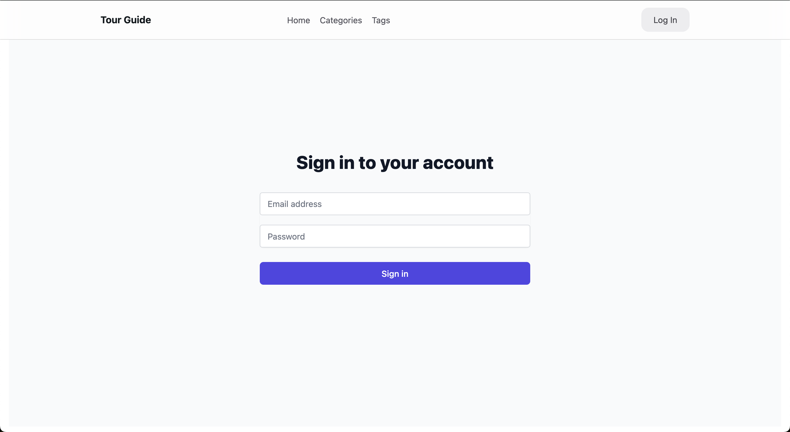
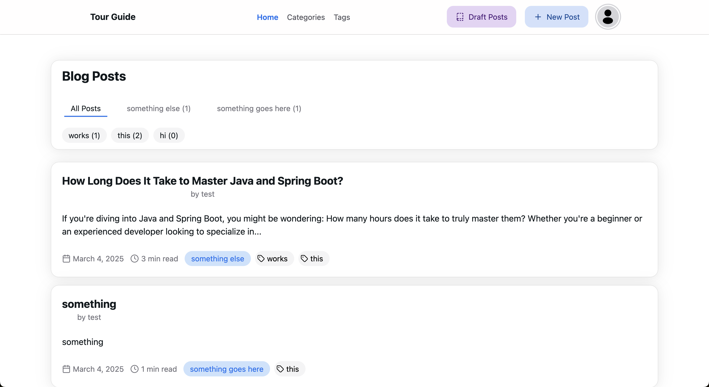
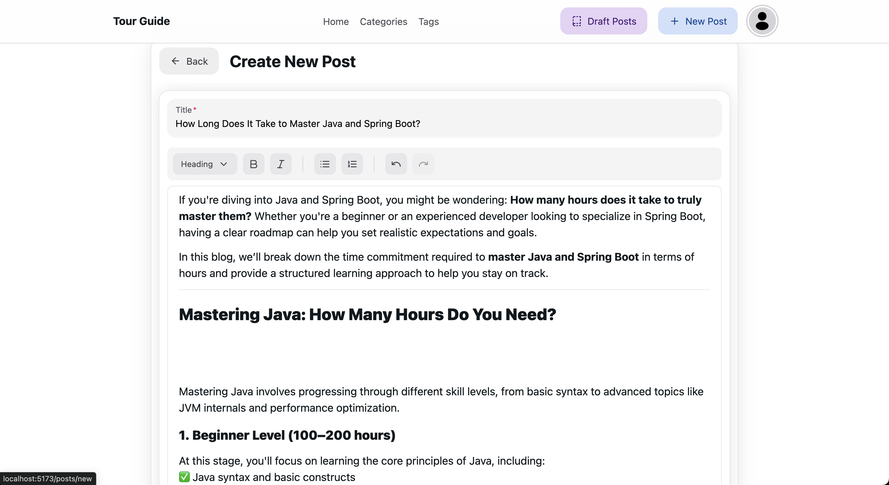
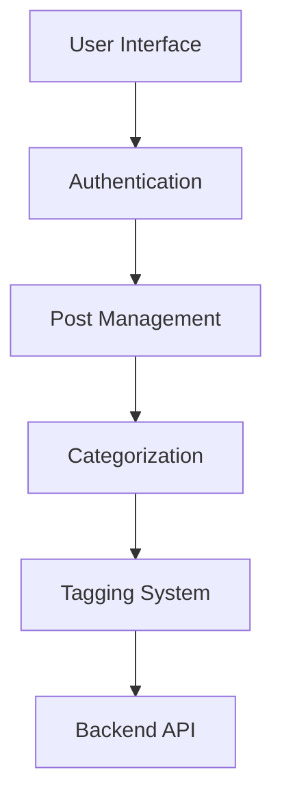
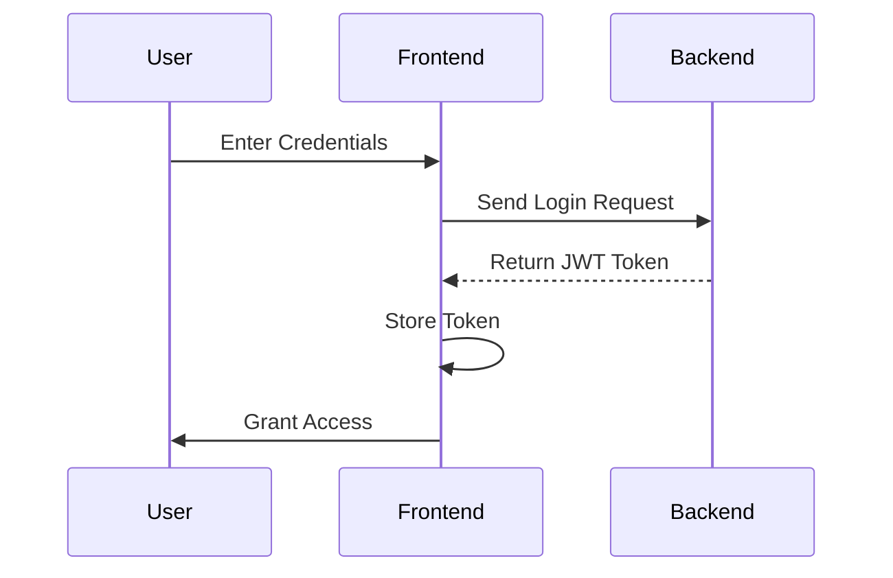

# 🌍 Atlas Frontend: Narrative Mapping Interface

## 🚀 Overview

Atlas Frontend is the user-facing application that brings territorial storytelling to life, providing an intuitive interface for creating, managing, and exploring location-based narratives.

## 🛠 Tech Stack

| Category | Technologies |
|----------|--------------|
| Language |  |
| Framework |  |
| Styling |  |
| Build Tool |  |
| State Management |  |

## 🌈 Key Features

| Feature | Description | User Impact |
|---------|-------------|-------------|
| 🔐 Secure Authentication | JWT-based login system | Trusted User Experience |
| 📝 Post Management | Create, edit, draft posts | Flexible Content Creation |
| 🏷️ Categorization | Tag and categorize content | Enhanced Discoverability |
| 🌐 Responsive Design | Mobile and desktop-friendly | Seamless Access |

## 📸 Screenshots

##### 1. Login Page


##### 2. Home/Posts Overview


##### 3. Post Creation Interface


##### 4. User Dashboard


##### 5. Mobile Responsive View


## 🏗️ Project Structure

```
src/
│
├── components/
│   ├── NavBar.tsx
│   ├── PostList.tsx
│   ├── PostForm.tsx
│   └── AuthContext.tsx
│
├── pages/
│   ├── HomePage.tsx
│   ├── LoginPage.tsx
│   ├── PostPage.tsx
│   ├── EditPostPage.tsx
│   └── DraftsPage.tsx
│
└── services/
    └── apiService.ts
```

## 🌐 Architecture Diagram



## 🚀 Key Technical Highlights

### Authentication Flow


### API Service Features
- 🔒 Singleton Axios Instance
- 🛡️ Request/Response Interceptors
- 🧩 Comprehensive Endpoint Coverage
- 🚦 Error Handling Mechanisms

## 🚀 Quick Start

### Prerequisites
- 🟢 Node.js 16+
- 📦 npm/yarn

### Installation Steps
1. Clone repository
2. Run `npm install`
3. Configure `.env` file
4. Run `npm run dev`

### Environment Variables
```
VITE_API_BASE_URL=http://localhost:8080/api/v1
```

## 🤝 Contributing

Help us map stories, one interface at a time:
1. 🍴 Fork the repository
2. 🌿 Create feature branch
3. 💾 Commit changes
4. 📤 Push to branch
5. 🔀 Create Pull Request

## 🧪 Testing

| Type | Tools |
|------|-------|
| Unit Testing | Jest |
| Component Testing | React Testing Library |
| E2E Testing | Cypress |

## 📦 Available Scripts

| Script | Description |
|--------|-------------|
| `npm run dev` | Start development server |
| `npm run build` | Production build |
| `npm run test` | Run test suite |
| `npm run lint` | Run code linter |
